<p align="center">
  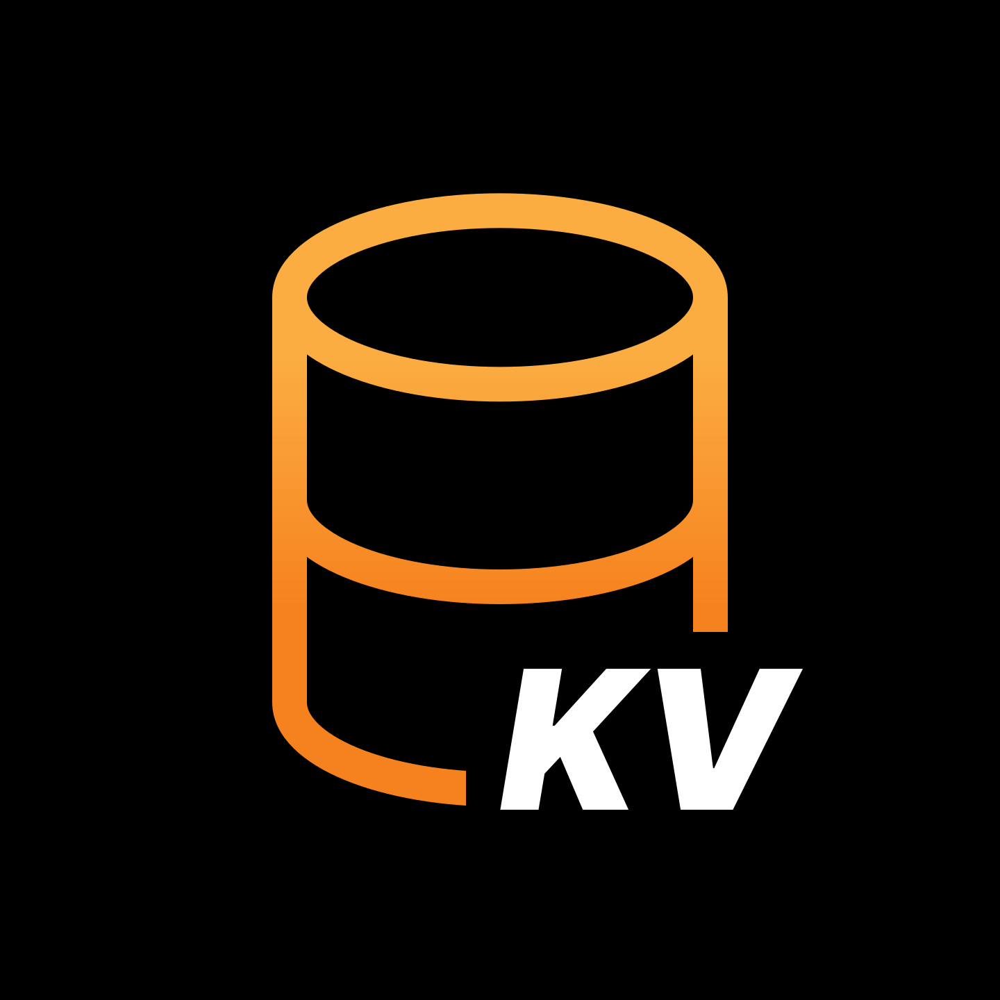
</p>

<h1 align="center">KVault</h1>

<p align="center">
  <strong>The desktop client for Cloudflare Workers KV</strong>
  <br />
  Navigate, search, and manage your KV data — without the dashboard friction.
</p>

<p align="center">
  <a href="#"></a>
  <a href="#"></a>
  <a href="#"></a>
  <a href="#"></a>
</p>

<p align="center">
  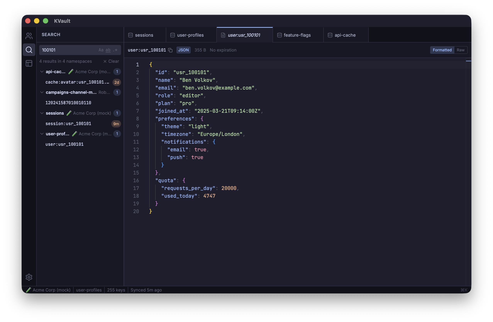
</p>

## Why KVault?

The Cloudflare dashboard was built for configuration, not for working with data. If you've ever tried to debug a production KV issue, search across namespaces, or manage keys in bulk — you know the pain.

KVault is purpose-built for **KV power users**. It brings the speed and convenience of a native desktop app to everything the dashboard makes tedious.

<br />

<table>
<tr>
<th width="50%">Cloudflare Dashboard</th>
<th width="50%">KVault</th>
</tr>
<tr>
<td>One account at a time</td>
<td><strong>All accounts & namespaces in a single tree view</strong></td>
</tr>
<tr>
<td>No cross-namespace search</td>
<td><strong>Global search across every namespace with regex support</strong></td>
</tr>
<tr>
<td>Plain text input for values</td>
<td><strong>Full Monaco editor with syntax highlighting & formatting</strong></td>
</tr>
<tr>
<td>No bulk operations</td>
<td><strong>Multi-select, bulk delete, bulk export</strong></td>
</tr>
<tr>
<td>No import capability</td>
<td><strong>Import from JSON or CSV with preview</strong></td>
</tr>
<tr>
<td>No saved searches or filters</td>
<td><strong>Saved filters per namespace with regex, case & word match</strong></td>
</tr>
<tr>
<td>No session memory</td>
<td><strong>Workspaces — save & restore your entire session</strong></td>
</tr>
<tr>
<td>Slow page-by-page browsing</td>
<td><strong>Virtualized key list — scroll through thousands instantly</strong></td>
</tr>
<tr>
<td>No keyboard shortcuts</td>
<td><strong>Command palette (Cmd+K) with 20+ actions</strong></td>
</tr>
<tr>
<td>Single theme</td>
<td><strong>9 themes including Catppuccin, Dracula, Nord & more</strong></td>
</tr>
</table>

<br />

## Features

### Multi-Account Management

Connect multiple Cloudflare accounts and browse all your namespaces in a unified tree view. No more logging in and out or switching between browser tabs. Each account shows its connection status and syncs independently.

<p align="center">
  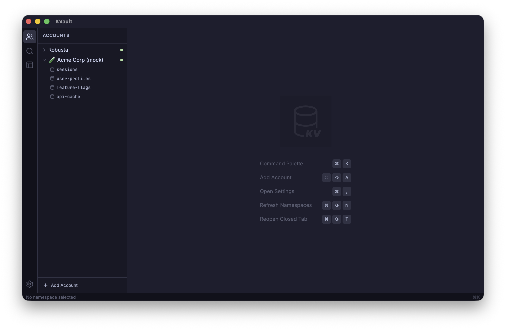
</p>

### Global Search

Search across **every namespace in every account** in one shot. Toggle case sensitivity, whole-word matching, or full regex — results are grouped by namespace with match counts so you can find that key in seconds, not minutes.

<p align="center">
  
</p>

### Advanced Filtering

Each namespace gets its own filter bar with real-time results. Save your frequently used filters by name and recall them instantly. Supports plain text, case-sensitive, whole-word, and regex modes.

### Monaco Editor

View and edit values in a full-featured code editor — the same one that powers VS Code. Auto-detects JSON and formats it for readability. Toggle between formatted and raw views. Save with `Cmd+S`, track dirty state, and never lose an edit.

<p align="center">
  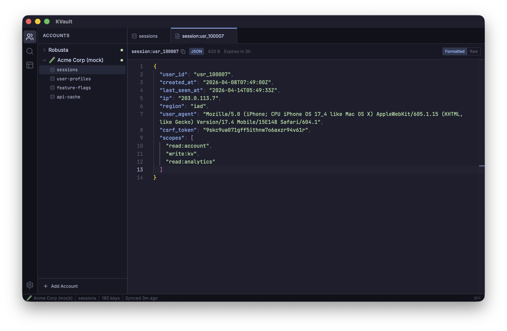
</p>

Hit `Cmd+S` to save and the status bar confirms the write:

<p align="center">
  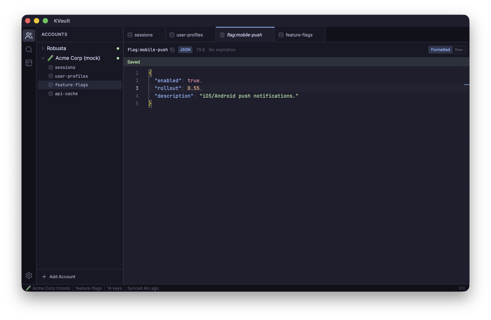
</p>

### Hex Viewer & Binary Support

Not all KV values are text. KVault detects binary data and renders a proper hex viewer with ASCII column. It even detects and previews embedded images (PNG, JPEG, GIF) inline.

### Workspaces

Working on a production incident across multiple namespaces? Save your entire session — open tabs, active filters, sidebar state — as a named workspace. Come back to it tomorrow exactly where you left off.

### Bulk Operations

Select multiple keys with checkboxes or range-select, then delete or export in batch. Export to JSON or CSV. Import keys from JSON or CSV files with a preview step before committing.

### TTL Visibility

Every key displays its time-to-expiration right in the list — `5d`, `2h`, `30m`, or `expired`. Set TTL when creating or updating keys. No more guessing which keys are about to vanish. When creating a new key, the dialog picks up JSON or plain text automatically and lets you set a TTL in seconds.

<p align="center">
  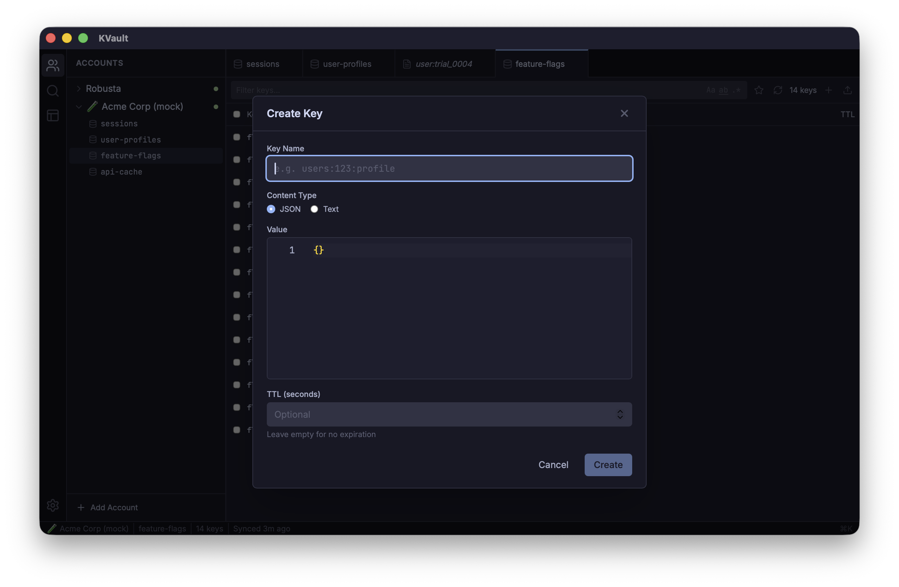
</p>

### Tabs & Navigation

Browse namespaces and keys in a tabbed interface. Preview tabs auto-replace as you navigate (pin to keep). Reopen recently closed tabs with `Cmd+Shift+T`. Dirty tabs show unsaved indicators.

### Command Palette

Press `Cmd+K` to access every action: switch accounts, open namespaces, create keys, sync, import, export, manage workspaces, and more — all without touching the mouse.

### Background Sync

Namespace keys sync from Cloudflare in the background with progress indicators. KVault caches key names locally in SQLite so filtering and search are instant — values are fetched on-demand.

### Secure Token Storage

API tokens are stored in your OS keychain (macOS Keychain, Windows Credential Manager, Linux Secret Service) — never in plain text or local databases.

<br />

## Keyboard Shortcuts

| Shortcut | Action |
|----------|--------|
| `Cmd+K` | Command palette |
| `Cmd+S` | Save current value |
| `Cmd+N` | Create new key |
| `Cmd+W` | Close active tab |
| `Cmd+P` | Quick open namespace |
| `Cmd+F` | Focus key filter |
| `Cmd+,` | Settings |
| `Cmd+Shift+T` | Reopen closed tab |
| `Cmd+Shift+R` | Re-sync namespace |
| `Cmd+Shift+E` | Export selected keys |
| `Cmd+Shift+A` | Add account |
| `Cmd+Delete` | Delete selected keys |

> On Windows/Linux, replace `Cmd` with `Ctrl`.

<br />

## Themes

KVault ships with **9 built-in themes** — 4 dark and 5 light — each applied consistently across the UI *and* the Monaco editor. Switch from the command palette or Settings; the same key looks right at home in every palette.

<table>
<tr>
<td width="50%" align="center">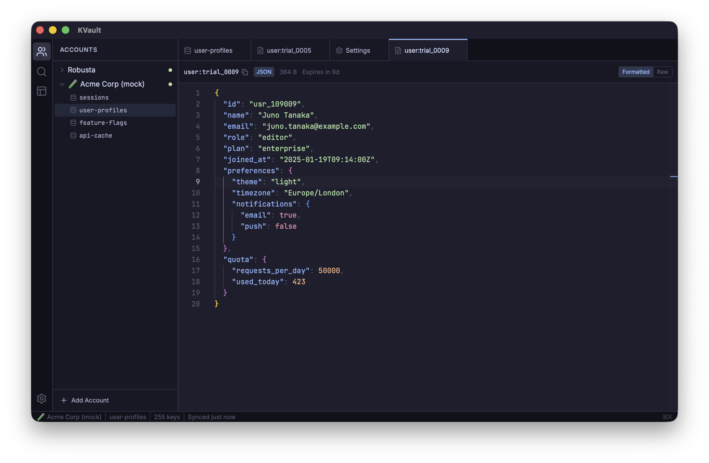<br /><sub><b>Catppuccin Mocha</b></sub></td>
<td width="50%" align="center">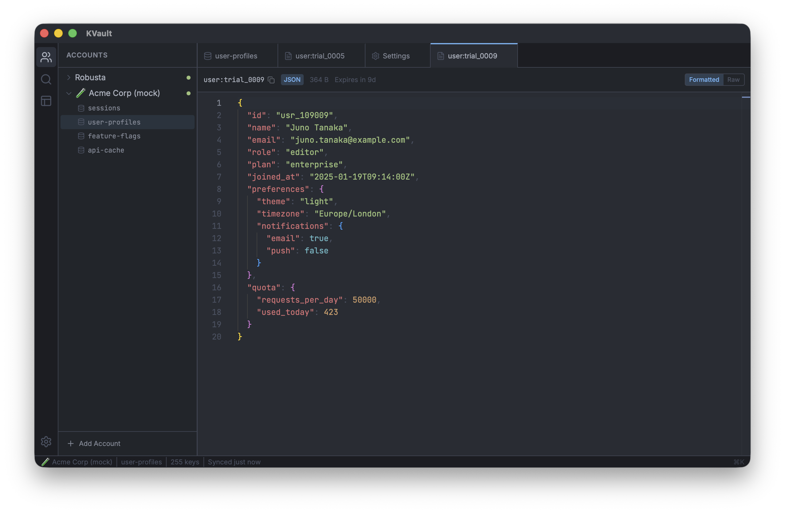<br /><sub><b>One Dark Pro</b></sub></td>
</tr>
<tr>
<td width="50%" align="center">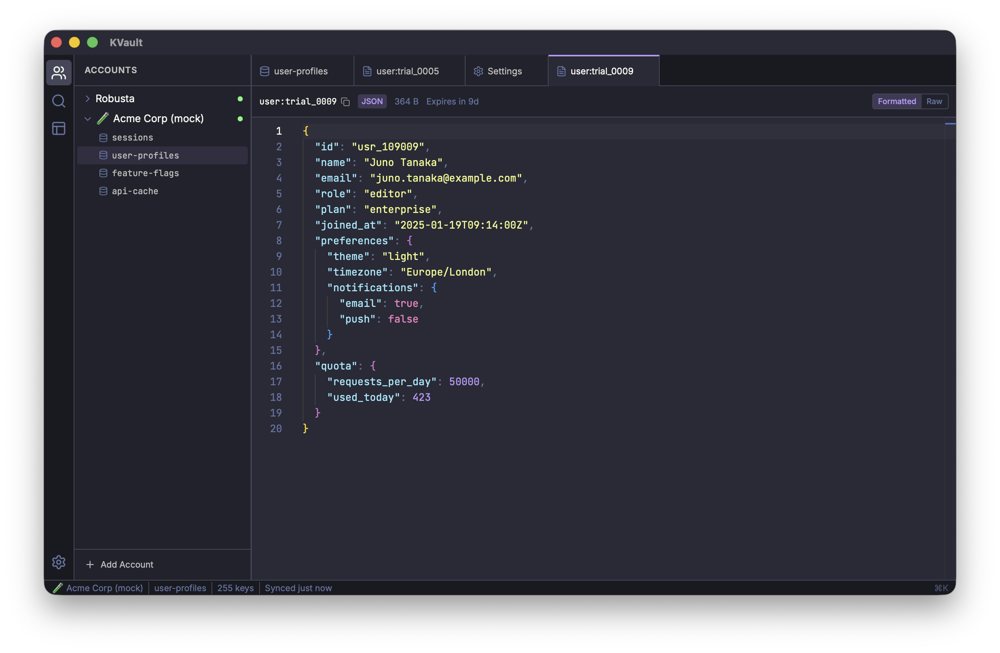<br /><sub><b>Dracula</b></sub></td>
<td width="50%" align="center">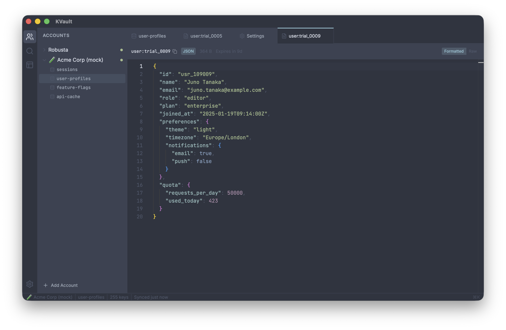<br /><sub><b>Nord</b></sub></td>
</tr>
<tr>
<td width="50%" align="center">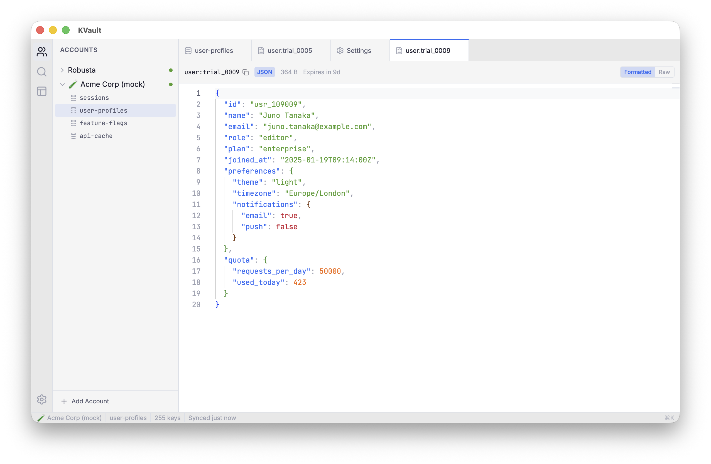<br /><sub><b>GitHub Light</b></sub></td>
<td width="50%" align="center">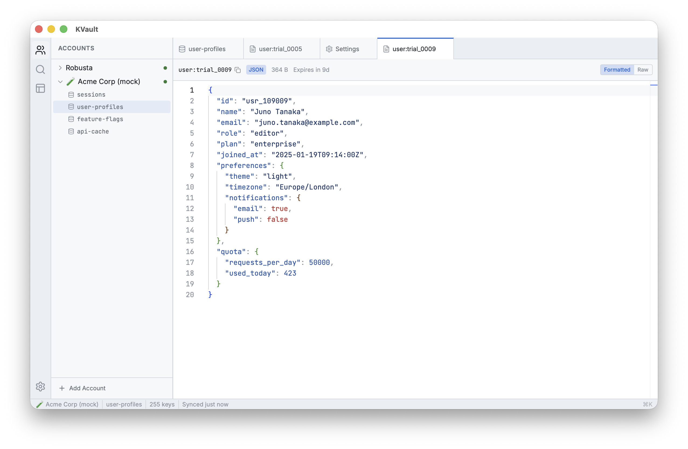<br /><sub><b>Catppuccin Latte</b></sub></td>
</tr>
<tr>
<td width="50%" align="center">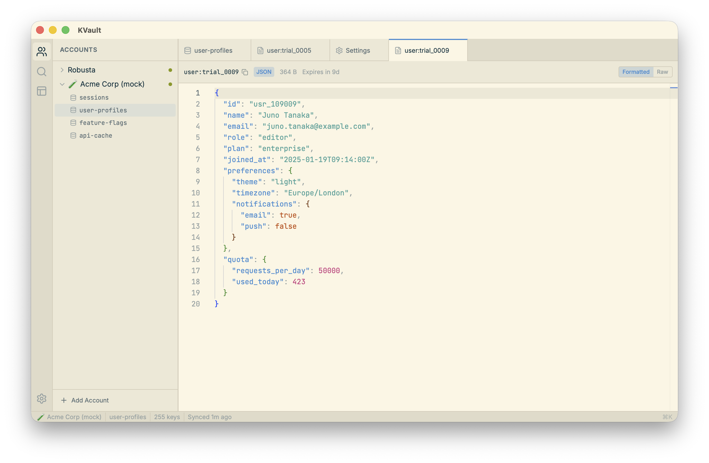<br /><sub><b>Solarized Light</b></sub></td>
<td width="50%" align="center">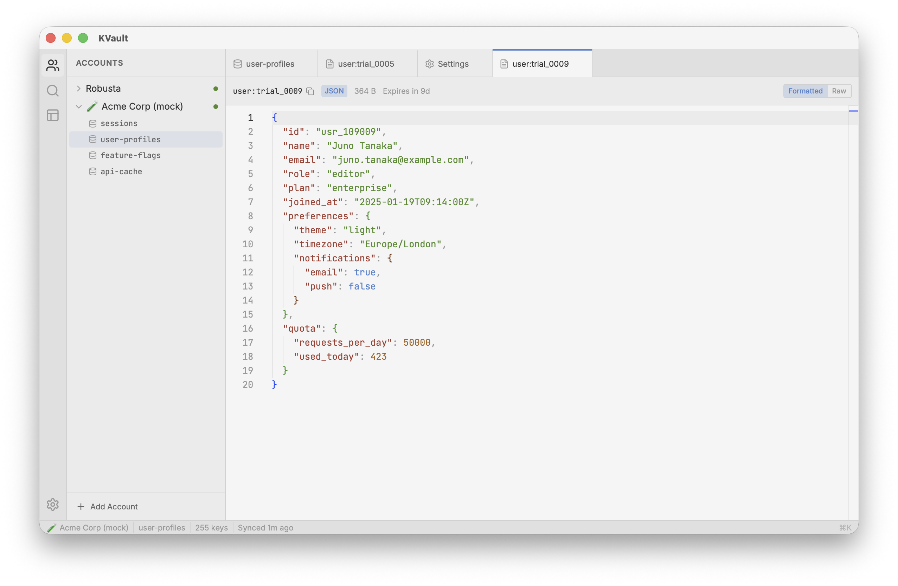<br /><sub><b>One Light</b></sub></td>
</tr>
<tr>
<td width="50%" align="center">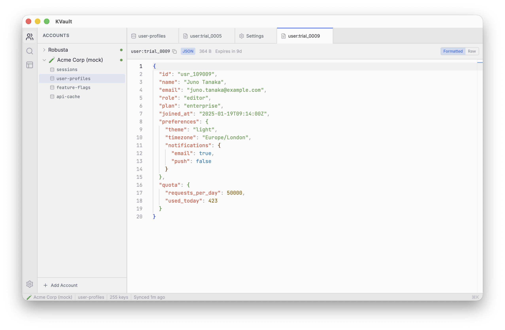<br /><sub><b>Quiet Light</b></sub></td>
<td width="50%"></td>
</tr>
</table>

<br />

## Download

Grab the latest build for your platform from the [**Releases**](https://github.com/uditalias/kvault/releases/latest) page.

| Platform | File | Notes |
|----------|------|-------|
| macOS (Apple Silicon) | `KVault_<version>_aarch64.dmg` | Apple Silicon |
| macOS (Intel) | `KVault_<version>_x64.dmg` | Intel-based Macs |
| Windows | `KVault_<version>_x64-setup.exe` / `.msi` | Windows 10/11, 64-bit |
| Linux (x86_64) | `KVault_<version>_amd64.AppImage` / `.deb` | x86_64 |
| Linux (ARM64) | `KVault_<version>_arm64.AppImage` / `.deb` | aarch64 |

> **macOS Gatekeeper:** the app isn't notarized yet. On first launch, right-click the app → **Open** (or run `xattr -dr com.apple.quarantine /Applications/KVault.app`).
>
> **Windows SmartScreen:** click **More info → Run anyway** — the binary is unsigned.
>
> **Linux compatibility:** KVault depends on `libwebkit2gtk-4.1-0` (GTK3). This is available on Ubuntu 22.04–24.04 (and equivalent Debian/Fedora). **Ubuntu 25.10+** dropped this package — users on those versions currently need to run Ubuntu 24.04 LTS in a VM/container, or wait for the upstream Tauri GTK4 migration.

Prefer a package manager or want to build it yourself? See [Build from Source](#build-from-source) below.

<br />

## Connect Your Account

1. Open KVault and click **Add Account** (or press `Cmd+Shift+A`)
2. Enter your Cloudflare account name and [API token](https://dash.cloudflare.com/profile/api-tokens)
3. KVault validates the token and loads your namespaces automatically

> Your API token needs the **Account > Workers KV Storage > Edit** permission.

<br />

## Build from Source

### Prerequisites

- [Node.js](https://nodejs.org/) (v18+)
- [Rust](https://www.rust-lang.org/tools/install)
- [Tauri CLI](https://v2.tauri.app/start/prerequisites/)

### Steps

```bash
git clone https://github.com/uditalias/kvault.git
cd kvault
npm install

# Dev mode
npm run tauri dev

# Production build (outputs to src-tauri/target/release/bundle/)
npm run tauri build
```

<br />

## Tech Stack

| Layer | Technology |
|-------|------------|
| Desktop Runtime | [Tauri 2](https://v2.tauri.app/) |
| Backend | Rust |
| Frontend | React 19, TypeScript |
| Editor | Monaco Editor |
| State Management | Zustand |
| Database | SQLite (via tauri-plugin-sql) |
| Styling | Tailwind CSS 4 |
| UI Components | Radix UI, cmdk |

<br />

## License

[MIT](LICENSE)

